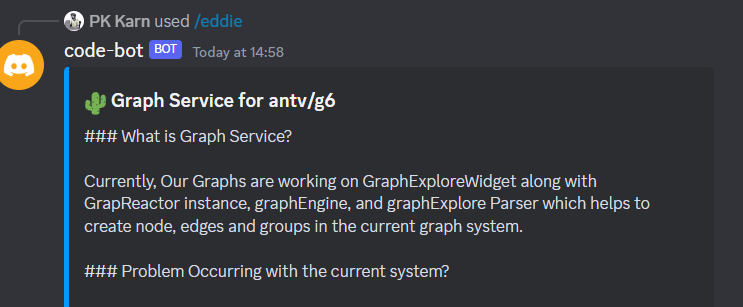

# Codebot - A Discord Bot for Managing GitLab Issues

Codebot is a Discord bot that uses OpenAI to manage GitLab issues. It allows you to interact with your GitLab issues using natural language, making it easy and intuitive to manage your project's issues from within Discord.

## Features

- Get GitLab issue details using natural language queries like `get me issue id from this project`
- More features to be added in the future

## Installation

1. Clone the repository:

```
git clone https://gitlab.com/yourusername/codebot.git
cd codebot
```


2. Update the `.env` file with your credentials:

```
GITLAB_KEY="glpat-<your_gitlab_key>"
BOT_TOKEN="<your_bot_token>"
CLIENT_ID="<your_client_id>"
OPENAI_KEY="sk-<your_openai_key>"
```


3. Install dependencies and run the bot:

```
npm install
npm run bot
```


4. Add the bot to your Discord server by following the instructions on the [Discord Developer Portal](https://discord.com/developers/applications).

5. Test the bot by typing `/eddie` followed by your query in your Discord server. For example:

`/eddie get me issue id from this project`


Codebot will respond with the requested information.

